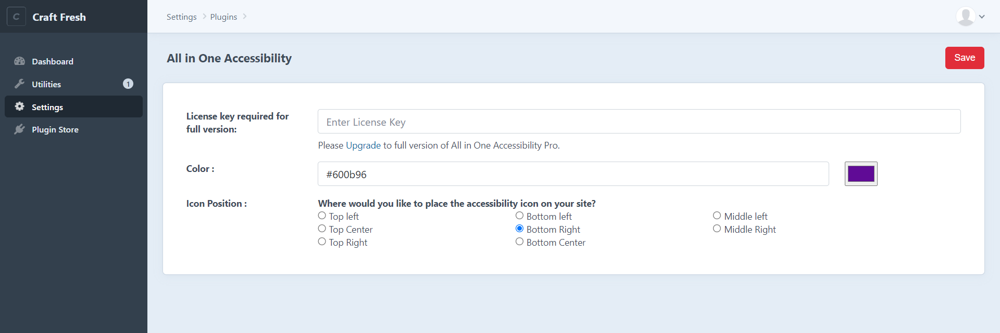

# All in One Accessibility plugin for Craft3 and Craft4

All in One Accessibility integration into Craft CMS 3 or 4.

More info on how to use All in One Accessibility can be found on the (https://www.skynettechnologies.com/all-in-one-accessibility).

## Styling

This plugin provide support for styling, as that's something that you should define in your application's stylesheet.

## Requirements

This plugin requires Craft CMS 3.0.0 or later.

## Installation

To install the plugin, follow these instructions.

1. Open your terminal and go to your Craft project:

        cd /path/to/project

2. Then tell Composer to load the plugin:

        composer require skynettechnologies/craft-allinoneaccessibility

3. In the Control Panel, go to Settings → Plugins and click the “Install” button for All in One Accessibility.

4. You can find out the basic features of free versions of All-in-one-accessibility on web page.

## Configuring All in One Accessibility

Go the plugin settings and configure All in One Accessibility the way you like.You can change the widget color & position.   

### License

All in One Accessibility is licensed under the MIT License - see the [LICENSE](LICENSE) file for details
